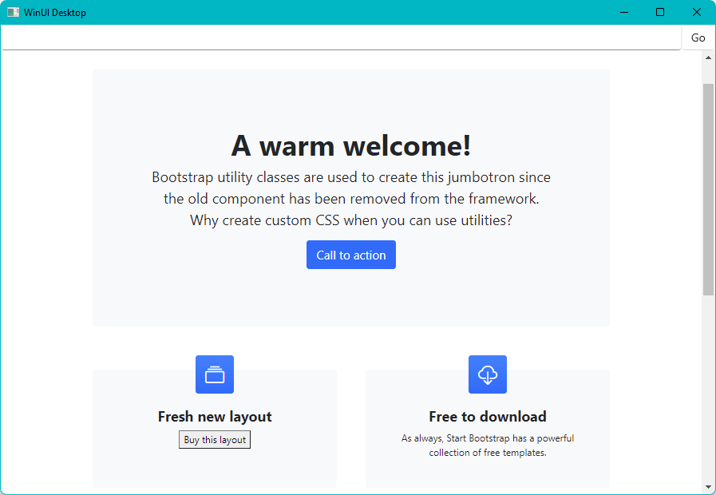

# Sample: WinUI3 / Windows App SDK 1.0.3 / Microsoft Store IAP

## Prerequisites 

Install tools for the Windows App SDK as outline here: [Install tools for the Windows App SDK](https://docs.microsoft.com/en-us/microsoft-edge/webview2/get-started/winui)

An app published to the Microsoft Store that contains at least one add-on. See: https://aka.ms/testmsiap

## Run the sample

Clone this repo and open the project in Visual Studio

Associate the sample with the app mentioned in the prerequisites. (Publish | Associate App with Store)

F5 Build, Deploy and Run the app.

Click on 'Buy this layout' in the web page. This will fire the ```CoreWebView2_WebMessageReceived``` handler in the app, calling ```RequestPurchaseAsync()``` prompting the user to purchase.




## Key point

The window handle of the main app needs to be associated with the StoreContext. Otherwise the purchase and other prompts will not display. See ```InitializeStoreContext()``` in the sample.


